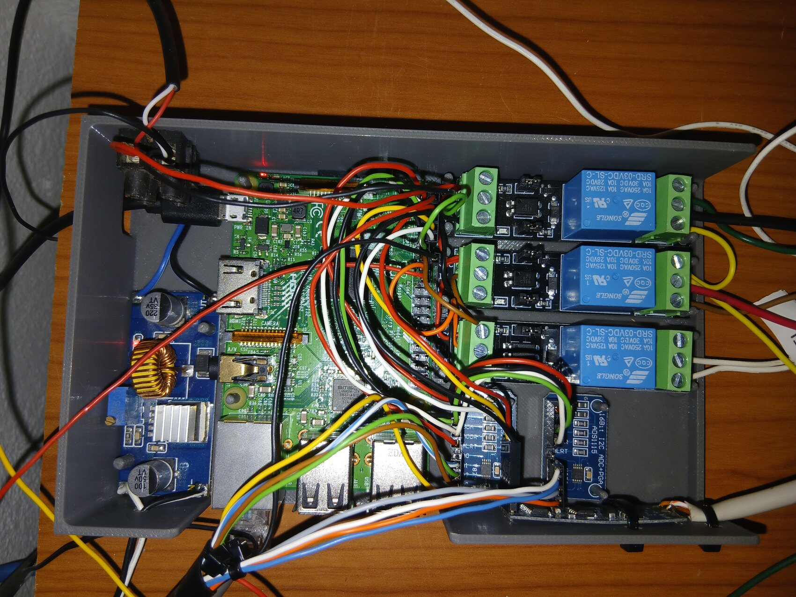
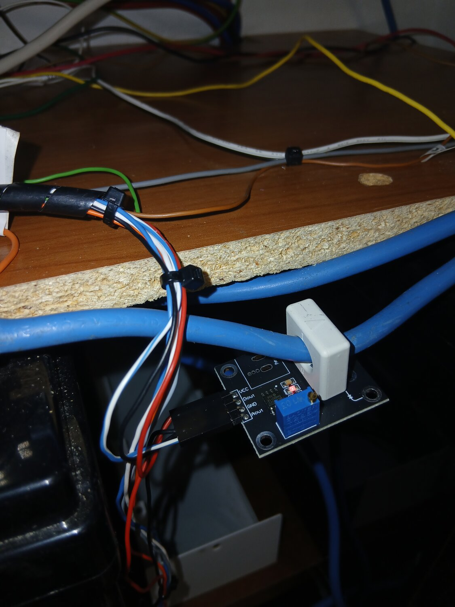

# RASPYNVERTER — monitoraggio e gestione inverter / fotovoltaico off-grid

Sistema **embedded** per monitorare e gestire un impianto solare **off-grid**, in esecuzione 24/7 su **Raspberry Pi 3**.
Legge l'inverter via **Modbus RTU**, misura correnti e tensioni della batteria con sensori a **effetto Hall** e **ADS1115** (I2C), stima lo **stato di carica a conteggio coulomb**, comanda il **bilanciamento dei banchi** e il **passaggio automatico a rete**, e mostra tutto in una **dashboard PWA** con grafici live e storici.

Backend **Flask + SQLite**, frontend **PWA con Chart.js** (funziona anche offline). Tutto su un singolo Pi.

## ✨ Caratteristiche

- **Dashboard PWA** a tema scuro: valori live, storico per ora / giorno / mese, installabile su smartphone. Grafici **Chart.js vendorizzati in locale** → nessuna CDN, funziona **offline**.
- **Lettura inverter** via Modbus RTU (`/dev/serial0`), robusta sia su **pymodbus 2.x** sia **3.x**, con fallback automatico a `minimalmodbus`.
- **Misura batteria indipendente** dall'inverter: correnti via **sensori Hall WCS1800**, tensioni dei due banchi via **partitori** → **2× ADS1115** (I2C, 16 bit).
- **Stato di carica a conteggio coulomb** con **auto-calibrazione al pieno** (regola fisica: tensione piena + corrente di coda + presenza di sole).
- **Controllo relè**: **bilanciamento attivo** dei due banchi (caricatore isolato sul banco più scarico) e **relè ENEL** che commuta sulla rete quando la tensione complessiva dei due banchi in serie scende sotto **46 V**.
- **Analisi off-grid giornaliera**: autonomia, energia prelevata dalla rete, salute della batteria LiFePO4, surplus fotovoltaico, diagnostica.
- **Storico** su SQLite con archiviazione e trim automatici.

## 🔌 Il sistema reale

Impianto **off-grid** monitorato: inverter ibrido **EASUN**, banco **LiFePO4 51,2 V / 500 Ah** (10 celle prismatiche, due banchi da 24 V in serie), correnti via sensori **Hall WCS1800**, tensioni via **ADS1115** (I2C), lettura inverter via **RS485 / Modbus RTU**.

**Centralina progettata e stampata in 3D** — in un solo chassis: il **Raspberry Pi**, il **convertitore DC-DC** che alimenta il Pi prelevando dal banco 1 a 24 V (+ tampone 5 V previsto), **2× ADS1115** che digitalizzano i sensori a **effetto Hall** (correnti) e i **partitori di tensione** (tensioni dei due banchi, istante per istante), e il modulo **RS485** che legge l'inverter via **Modbus** e alimenta la dashboard. I **3 relè** comandano il **bilanciamento attivo** dei due banchi e il **relè ENEL**, che commuta sulla rete quando la tensione complessiva scende sotto **46 V**.



| Impianto completo | Quadro (inverter, contatori, Pi) |
|:---:|:---:|
|  |  |

| Raspberry Pi + GPIO | Sensore corrente Hall WCS1800 | Adattatore RS485 (Modbus) |
|:---:|:---:|:---:|
|  |  |  |

<sub>Foto del sistema reale in funzione · metadati EXIF rimossi.</sub>

## 📊 Dashboard

PWA con tema scuro, grafici **Chart.js** (DB-backed) e valori **live**: inverter via **Modbus RTU**, tensioni di cella via **I2C ADS1115**, totali energia del giorno.


| ☀️ Produzione fotovoltaica (live) | 📈 Energia per ora (storico) |
|:---:|:---:|
|  |  |

🔋 **Batteria** — SOC, potenza / tensione / corrente, tensioni **per-cella** (ADS1115), taratura e storico celle:


<p align="center"></p>

<sub>Screenshot dal sistema reale in funzione — dati live.</sub>

## 🧱 Architettura

Backend Python in moduli a responsabilità separata (grafo delle dipendenze aciclico `config` → `database` / `hardware` → `inverter_api`):

| Modulo | Responsabilità |
|---|---|
| `config.py` | path, caricamento `inverter_config.json`, costanti Modbus/I2C, mappa registri, helper |
| `database.py` | layer SQLite (campioni, archivio, contatori batteria, snapshot I2C) + archiviazione/trim |
| `hardware.py` | accesso hardware: I2C (ADS1115), Modbus RTU, GPIO/relè; mantiene lo stato runtime |
| `daily_analyzer.py` | analisi off-grid per la pagina `/analysis` |
| `inverter_api.py` | entrypoint: app Flask, poll loop in thread, route REST, `main()` |

Frontend **PWA** in `web/`: template Jinja con `_base.html` condiviso, service worker (`sw.js`), web manifest e `chart.umd.min.js` servito in locale (dashboard offline).

## 🛠️ Hardware

- **Raspberry Pi 3**
- **Inverter ibrido** con interfaccia Modbus RTU / RS485 (qui un **EASUN**)
- **Banco LiFePO4** (qui 51,2 V / 500 Ah — due banchi da 24 V in serie, 10 celle prismatiche)
- **2× ADS1115** (ADC I2C 16 bit, indirizzi `0x48` / `0x49`)
- **Sensori di corrente a effetto Hall WCS1800** (alimentati a **3,3 V**, non 5 V: l'ADS1115 non è 5 V-tolerant)
- **Partitori di tensione** per i due banchi
- **Modulo RS485 ↔ TTL** per la UART del Pi
- **Convertitore DC-DC** 24 V → 5 V per alimentare il Pi dal banco
- **Moduli relè** (bilanciamento banchi + relè ENEL)
- **Chassis stampato in 3D** che integra il tutto

## ⚙️ Prerequisiti (Raspberry Pi OS / Debian)

1. **UART hardware** per il Modbus (`/dev/serial0`):
   ```bash
   sudo raspi-config   # Interface Options → Serial Port: login shell = NO, hardware = YES
   ```
   Sul Pi 3 conviene liberare la UART dal Bluetooth. In `/boot/firmware/config.txt`:
   ```
   enable_uart=1
   dtoverlay=disable-bt
   ```
   poi `sudo systemctl disable --now hciuart serial-getty@ttyAMA0 && sudo reboot`.
   > ⚠️ La **console di login seriale** va disattivata: se resta attiva «mangia» i byte del Modbus e l'inverter sembra muto. Verifica che `console=serial0,115200` non sia presente in `/boot/firmware/cmdline.txt`.

2. **I2C** per gli ADS1115:
   ```bash
   sudo raspi-config   # Interface Options → I2C → Enable
   i2cdetect -y 1      # devono comparire 0x48 e 0x49
   ```

3. Utente nei gruppi hardware:
   ```bash
   sudo usermod -aG dialout,i2c,gpio "$USER"
   ```

## 🚀 Installazione

```bash
# sul Raspberry Pi
git clone https://github.com/corgiolu-labs/raspinverter.git
cd raspinverter
python3 -m pip install --break-system-packages -r requirements.txt   # oppure in un venv

sudo cp inverter.service /etc/systemd/system/inverter.service
sudo systemctl daemon-reload
sudo systemctl enable --now inverter.service
journalctl -u inverter.service -f      # log live
```

Poi apri la dashboard su **`http://<ip-del-pi>:8000`**.

> Su Debian Trixie, se l'init dei relè (GPIO) fallisce, installa `rpi-lgpio` (fornisce l'API `RPi.GPIO` sul nuovo kernel).

## 🔧 Configurazione

`config/inverter_config.json` — parametri seriali, batteria LiFePO4 (capacità, soglie SOC), soglie relè (bilanciamento, ENEL), canali e offset degli ADC. Modificabile anche dalla pagina **`/settings`**. Il database SQLite si crea da solo in `data/` al primo avvio.

## 🩺 Diagnostica Modbus

Il bus `/dev/serial0` è **condiviso**: ferma il servizio prima di un test manuale (non possono leggere insieme).
```bash
sudo systemctl stop inverter.service
python3 realtime_inverter_test.py --port /dev/serial0 --baud 9600 --unit-id 1 --interval 5
sudo systemctl start inverter.service
```
La scheda **🔧 Diagnostica** della dashboard offre inoltre test relè, lettura live Modbus/I2C e reset dei contatori batteria.

## 📄 Licenza

Distribuito sotto **Creative Commons Attribution-NonCommercial 4.0** (CC BY-NC 4.0) — vedi [LICENSE](LICENSE). © 2026 Alessandro Corgiolu.
