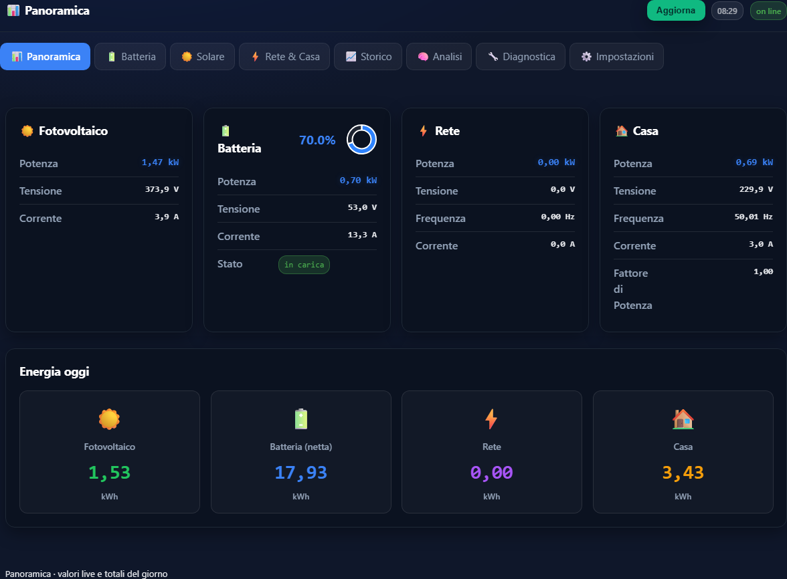
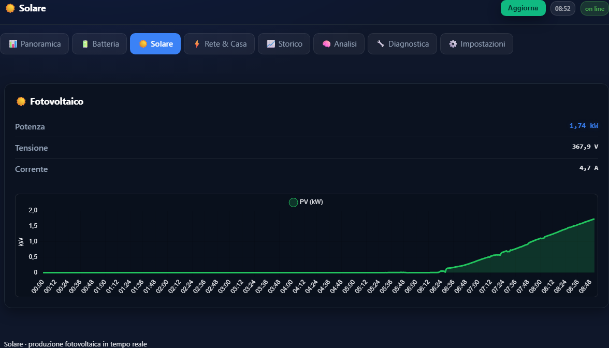
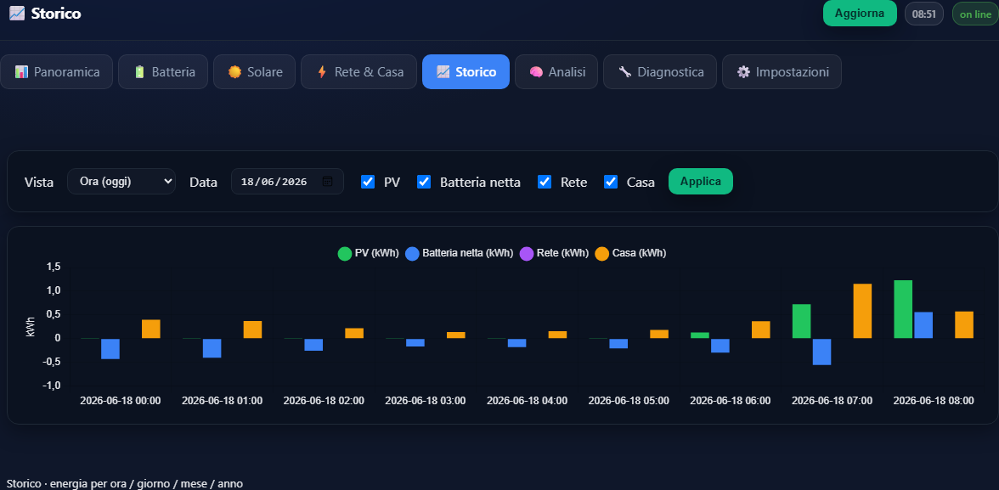
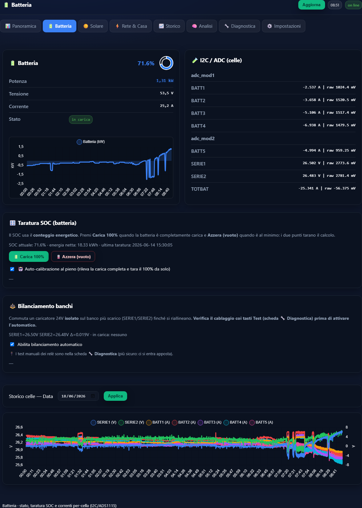
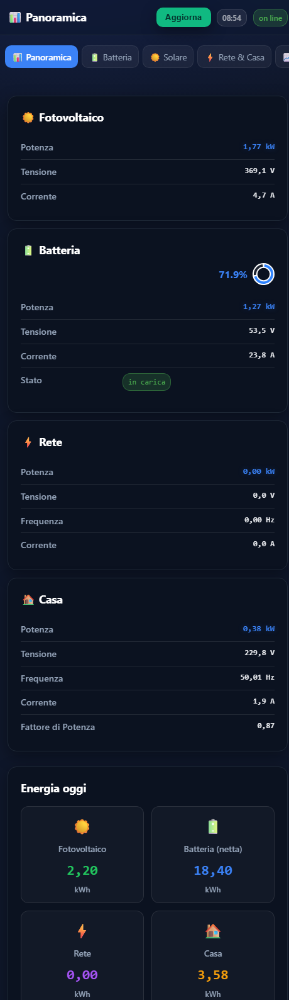
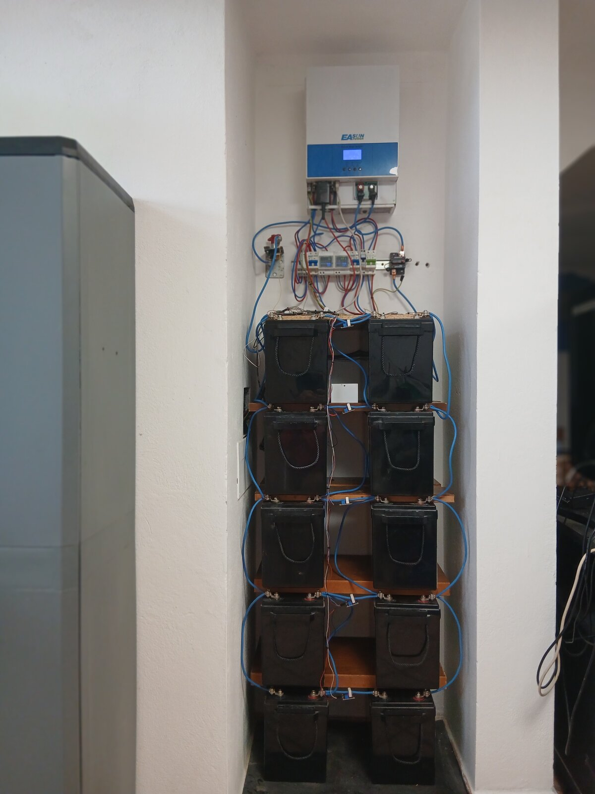
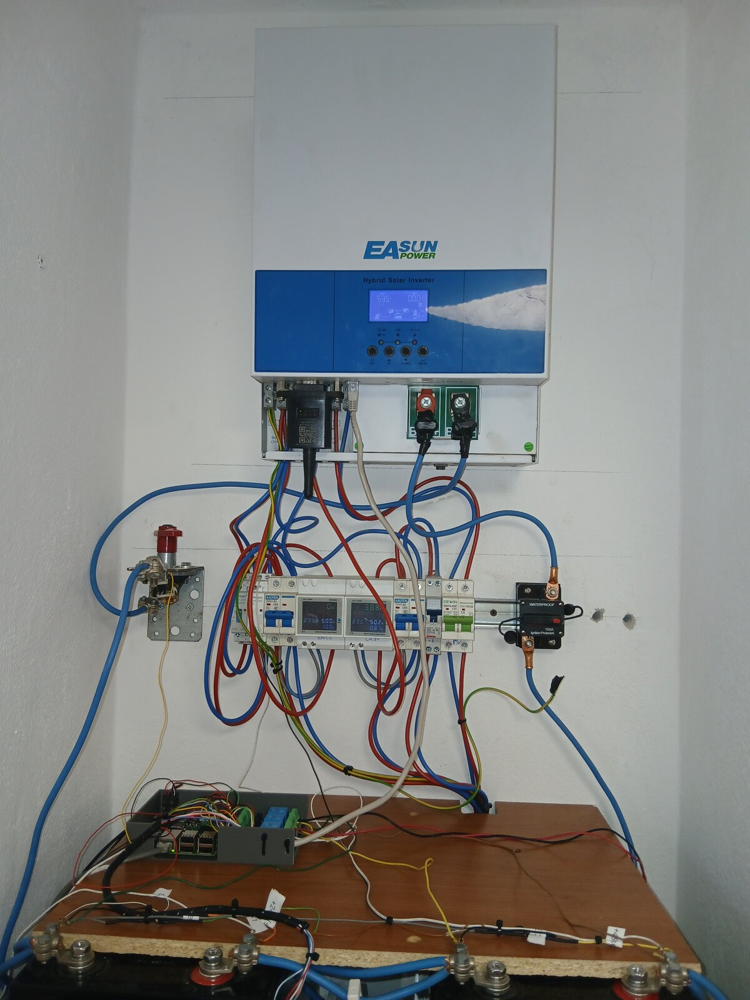
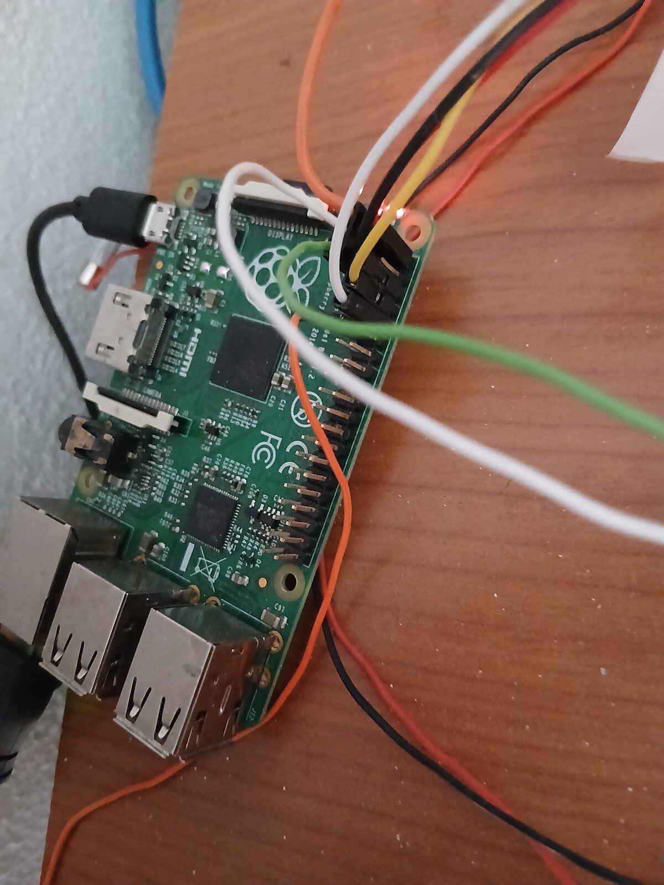
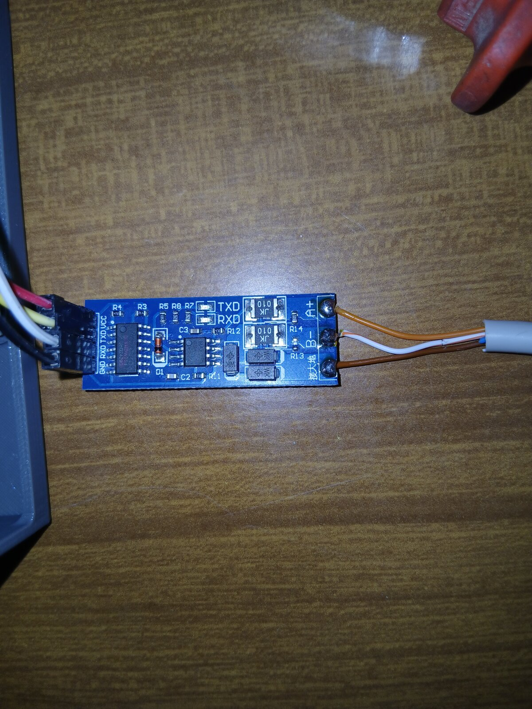

# RASPYNVERTER — Monitor Inverter / Fotovoltaico

Versione **distillata e ottimizzata** del software, pensata per girare sul Raspberry Pi 3 **RASPYNVERTER**.
Backend Flask + SQLite, dashboard PWA con grafici **Chart.js DB-backed**, lettura inverter **Modbus RTU** + sensori **I2C ADS1115**, controllo **relè** GPIO.

## Dashboard

PWA con tema scuro, grafici **Chart.js** (DB-backed) e valori **live**: inverter via **Modbus RTU**, tensioni di cella via **I2C ADS1115**, totali energia del giorno.



| ☀️ Produzione fotovoltaica (live) | 📊 Energia per ora (storico) |
|:---:|:---:|
|  |  |

🔋 **Batteria** — SOC, potenza/tensione/corrente, tensioni **per-cella** (ADS1115), taratura e storico celle:



<p align="center"></p>

<sub>Screenshot dal sistema reale in funzione (Raspberry Pi 3 «RASPYNVERTER») — dati live.</sub>

## Il sistema reale

Impianto **off-grid** monitorato: inverter ibrido **EASUN**, banco **LiFePO4 51,2 V / 500 Ah** (10 celle prismatiche), correnti di cella via sensori **Hall WCS1800**, tensioni via **ADS1115** (I2C), lettura inverter via **RS485 / Modbus RTU**, relè di load-control e bilanciamento banchi.

| Impianto completo | Quadro (inverter, contatori, Pi) |
|:---:|:---:|
|  |  |

| Raspberry Pi + cablaggio GPIO | Adattatore RS485 (Modbus RTU) |
|:---:|:---:|
|  |  |

<sub>Foto del sistema reale in funzione · metadati EXIF rimossi.</sub>

## Cosa è cambiato rispetto all'originale
- ❌ Rimosso `auto_graph_generator.py` e la cartella `graphs/` (generavano PNG mensili **mai usati** dalla web app) → **eliminate le dipendenze pesanti `matplotlib` + `seaborn` + `pandas`**.
- ❌ Rimosso `inverter.log` (artefatto vecchio).
- ✅ **Chart.js vendorizzato in locale** (`web/chart.umd.min.js`, servito da Flask) → la dashboard funziona **offline**, senza CDN/internet.
- ✅ **Modbus hardened**: `read_regs()` ora funziona sia con **pymodbus 2.x** sia **3.x** (costruttore + `slave=`/`unit=`), con fallback reale a `minimalmodbus`. Niente più "inverter a zero in silenzio" su pymodbus recente.
- ✅ Aggiunti `requirements.txt` e unit `inverter.service` (persistenza + restart automatico → risolve il `Port 8000 already in use`).

Funzionalità invariate: tutti gli endpoint API, la pagina `/` (dashboard live), `/analysis` (analisi `DailyAnalyzer`), `/settings`, relè, contatori batteria, archivio/trim DB.

## Struttura del codice
Il backend è stato spezzato dal monolite originale (~2240 righe) in moduli con responsabilità separate:
- **`config.py`** — path, caricamento `inverter_config.json`, costanti Modbus/I2C, mappa registri `REGS`, helper.
- **`database.py`** — layer SQLite (samples/archive/battery_counters/i2c_snapshots), archivio/trim, contatori batteria.
- **`hardware.py`** — accesso hardware: I2C (ADS1115), Modbus RTU, GPIO/relè. Possiede lo stato `LAST_ERR`/`LAST_OK`/`RELAY_STATE` (letto come `hardware.X`).
- **`daily_analyzer.py`** — analisi off-grid per la pagina `/analysis`.
- **`inverter_api.py`** — entrypoint: app Flask, hook, `poll_loop`, le route REST, `main()`. È quello lanciato dal servizio systemd.

Il deploy non cambia: `rsync` dell'intera cartella + `ExecStart=python3 inverter_api.py` (importa i moduli dalla stessa dir).

## Prerequisiti sul Pi (Debian Trixie)
1. **Seriale** per il Modbus (`/dev/serial0`):
   ```bash
   sudo raspi-config   # Interface Options > Serial Port:  login shell = NO,  hardware = YES
   ```
   Sul Pi3 conviene liberare la UART hardware dal Bluetooth (baud più stabile). In `/boot/firmware/config.txt`:
   ```
   enable_uart=1
   dtoverlay=disable-bt
   ```
   poi `sudo systemctl disable hciuart && sudo reboot`.
2. **I2C** per gli ADS1115:
   ```bash
   sudo raspi-config   # Interface Options > I2C > Enable
   # verifica: i2cdetect -y 1   (devono comparire 0x48 e 0x49)
   ```
3. L'utente `raspynverter` nei gruppi hardware (per i run manuali):
   ```bash
   sudo usermod -aG dialout,i2c,gpio raspynverter
   ```

## Deploy
Dal PC (cartella `RASPYNVERTER_PI3`), copia sul Pi via cavo (.222):
```bash
rsync -av --delete ./  raspynverter@192.168.137.222:/home/raspynverter/RASPYNVERTER_SOFTWARE/
```
Sul Pi:
```bash
cd /home/raspynverter/RASPYNVERTER_SOFTWARE
python3 -m pip install --break-system-packages -r requirements.txt   # oppure in un venv

sudo cp inverter.service /etc/systemd/system/inverter.service
sudo systemctl daemon-reload
sudo systemctl enable --now inverter.service
systemctl status inverter.service --no-pager
journalctl -u inverter.service -f      # log live
```

## Accesso
- Via cavo:    `http://192.168.137.222:8000`
- Via hotspot: `http://10.42.1.1:8000`

## Note operative
- **Database:** SQLite in `data/` (auto-creato al primo avvio). Per **migrare lo storico** dal vecchio Pi B+, copia il suo DB in `data/` prima del primo avvio.
- **Diagnostica Modbus** — il bus seriale `/dev/serial0` è **condiviso**, quindi ferma prima il servizio (non possono leggere insieme):
  ```bash
  sudo systemctl stop inverter.service
  python3 realtime_inverter_test.py --port /dev/serial0 --baud 9600 --unit-id 1 --interval 5
  sudo systemctl start inverter.service   # a test finito
  ```
- **Config:** `config/inverter_config.json` (seriale, batteria LiFePO4, soglie relè, canali ADC). Modificabile anche da `/settings`.
- **Relè GPIO17**: se l'init fallisce su Trixie, verifica che `rpi-lgpio` sia installato (fornisce l'API `RPi.GPIO`).
